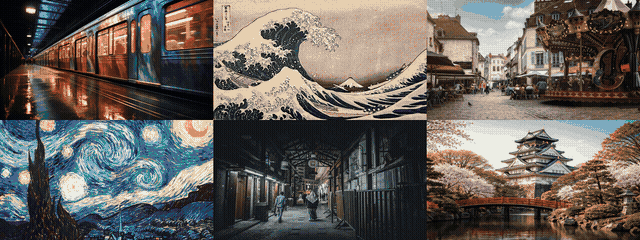

# Description Diffusion Loop

Describe an image with a vision LLM, rediffuse it using that description as the prompt, repeat. Each cycle of lossy translation — image to text to image — compounds subtle reinterpretations, producing a perceptual drift away from the original.



## How it works

```
Input Image → [Vision LLM describes it] → description text
                                              ↓
             [SDXL img2img with description as prompt] → new image
                                              ↓
                                         loop back ↻
```

Each iteration:
1. A vision model (e.g. Gemma 3 via LM Studio) describes what it *sees* in the current image
2. That description becomes the prompt for an SDXL img2img pass
3. The output becomes the input for the next iteration
4. Reinterpretations compound — the image drifts through layers of lossy translation

## Setup

### Requirements
- Python 3.10+
- A vision LLM running on an OpenAI-compatible API (e.g. [LM Studio](https://lmstudio.ai/) with Gemma 3)
- GPU: NVIDIA (CUDA) or Apple Silicon (MPS)

### Install

```bash
pip install -r requirements.txt
```

### Vision LLM

Start [LM Studio](https://lmstudio.ai/) with a vision model (recommended: Gemma 3) and enable the local API server (default: `http://127.0.0.1:1234`).

Or use any OpenAI-compatible vision API by setting:
```bash
export VISION_API_URL="http://your-server:port/v1/chat/completions"
export VISION_MODEL="your-model-name"  # optional, some servers auto-detect
```

## Usage

```bash
# Basic — 300 iterations with Juggernaut XL
python hloop.py photo.jpg

# Custom settings
python hloop.py photo.jpg \
  --iterations 500 \
  --strength 0.3 \
  --temperature 1.5 \
  --output-dir my_run

# With negative prompt to steer away from unwanted artifacts
python hloop.py photo.jpg \
  --negative-prompt "blurry, low quality, out of focus"

# Use a different SDXL model
python hloop.py photo.jpg --model stabilityai/stable-diffusion-xl-base-1.0
```

### Key parameters

| Parameter | Default | Description |
|-----------|---------|-------------|
| `-n, --iterations` | 300 | Number of loop iterations |
| `-s, --strength` | 0.3 | img2img noise strength (lower = more faithful, higher = more creative) |
| `-g, --guidance` | 7.5 | CFG guidance scale |
| `-t, --temperature` | 1.5 | Vision LLM temperature (higher = more diverse descriptions) |
| `-m, --model` | `RunDiffusion/Juggernaut-XL-v9` | HuggingFace SDXL model ID |
| `--negative-prompt` | None | Negative prompt for diffusion |
| `-W, --width` | 1280 | Output width |
| `-H, --height` | 720 | Output height |

### Resume interrupted runs

If a run is interrupted, just re-run the same command — it automatically resumes from the last completed step:

```bash
# This will continue from where it left off
python hloop.py photo.jpg --output-dir my_run
```

## Output

```
output/
├── images/
│   ├── step_0000.png    # original input (resized)
│   ├── step_0001.png    # first hallucination
│   ├── step_0002.png
│   └── ...
├── descriptions/
│   ├── step_0000.txt    # what the vision LLM saw at each step
│   ├── step_0001.txt
│   └── ...
└── log.json             # full run log
```

## Tips

- **Strength 0.2-0.3** gives smooth, gradual transitions. **0.5+** changes faster but can be chaotic.
- **Temperature 1.5** for the vision LLM produces diverse, creative descriptions that drive more variation. Lower values (0.3-0.7) keep descriptions conservative.
- **Negative prompts** like `"blurry, low quality, out of focus"` help maintain image sharpness across iterations.
- **Color matching** is built-in (50% by default) to prevent color drift across iterations.
- The SDXL pipeline is loaded once and reused for all steps. Memory peaks during initial load.

## Hardware notes

- **Apple Silicon (MPS)**: Uses float32. ~60-90s per step on M-series chips. 16GB+ RAM recommended.
- **NVIDIA CUDA**: Uses float16 by default. Much faster. Override with `--dtype fp32` if needed.
- **HuggingFace cache**: Set `HF_HOME=/path/to/cache` to store model weights on an external drive.

## License

MIT
